## Basic Shell and Computer Networking


Jaringan Komputer adalah dua atau lebih perangkat komputer yang saling terhubung atau terkoneksi antara satu dengan yang lain

Kembali lagi bersama saya Alfino Dwi Nugroho pada kali ini saya akan memberikan tutorial atau cara dari task tentang “Basic Shell and Computer networking”.

Baca juga
[Tutorial Install Ubuntu Server 20.04 LTS Menggunakan VirtualBox](https://github.com/pinoezz/DevOps/blob/main/stage1/Week-1/Day1/Instalasi-Ubuntu-Server.md)

# Sebelum memulai task kali ini saya akan memberitahu secara singkat perintah perintah dasar pada CLI linux :

# sudo
sudo merupakan singkatan dari “SuperUser Do” dan berfungsi untuk menjalankan task yang memerlukan hak akses (permission) administrative atau root

Contoh penggunaanya adalah sudo apt update; sudo apt upgrade berfungsi untuk meng-update serta meng-upgrade sistem kita agar tetap up to date

```
sudo apt update; sudo apt upgrade
```

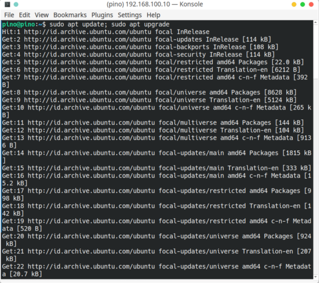

# mkdir​
mkdir adalah perintah untuk membuat suatu directory. Sebagai contoh coba kalian buat directory dengan nama pino.

```
mkdir
```


# ls
ls adalah perintah untuk melihat list apa saja yang ada di directory.

```
ls
```


# cd
cd adalah perintah untuk masuk ke dalam directory.

```
cd
```

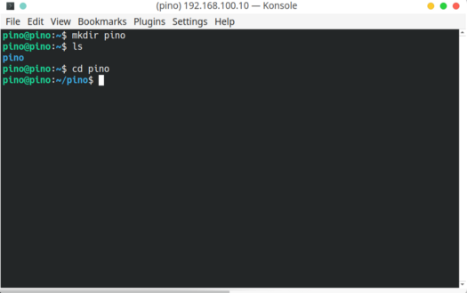

# ls -la​

ls -la adalah perintah untuk melihat semua list file dan directory yang ada serta menampilkan semua file maupun directory yang tersembunyi.

```
ls -la
```


# cd ..​
cd .. adalah perintah untuk keluar dari directory.

```
cd ..
```


# touch​
touch adalah perintah untuk membuat suatu file. Sebagai contoh coba kalian buat suatu file dengan nama index.html.

```
touch index.html
```


# cp​

cp adalah perintah untuk meng-copy file serta mengubahnya dengan nama yang kalian inginkan. sebagai contoh coba kalian copy file index.html yang sudah kalian buat tadi lalu ubah dengan nama file index.

```
cp index.html index
```


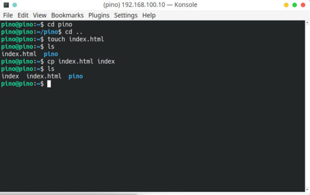

# mv​
mv adalah sebuah perintah untuk me-rename nama file, tetapi juga dapat digunakan untuk memindahkan suatu file ke directory tertentu. Sebagai contoh coba kalian ubah nama file index tadi dengan nama index.js lalu buat sebuah directory baru lalu pindahkan file index.js tadi ke directory yang sudah kalian buat.

```
mv index index.js
```


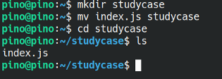

Berikut adalah beberapa command pada linux, untuk lengkapnya kalian bisa cek di sini : 
[Basic Linux](https://bit.ly/3wTzrlL)

# Mengubah IP Server

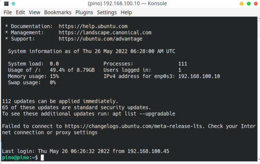

Ip yang saya gunakan sebelumnya adalah 192.168.100.10 , saya akan mengubahnya menjadi 192.168.100.20

```
sudo nano /etc/netplan/00-installer-config.yaml
```

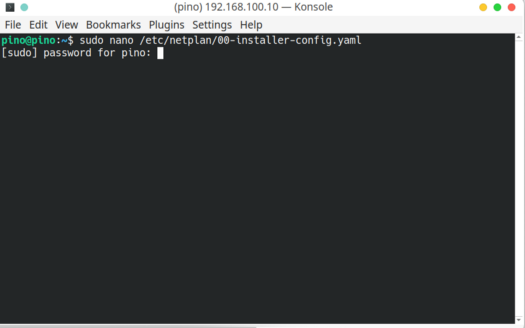

Kemudian silahkan kalian masukan password root


Selanjutnya tampilan akan berubah menjadi text editor pada addresses enp0s3 saya akan ubah menjadi 192.168.100.20/24

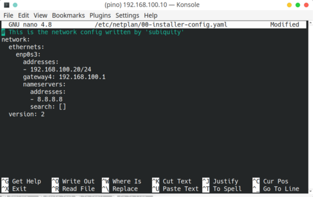

Kemudian untuk save dan exit kalian tekan ctrl+o (write out)lalu enter kemudian ctrl + x untuk exit

Selanjutnya untuk mengkonfirmasi customisasi IP yang sudah kalian buat tadi kalian bisa menggunakan perintah dibawah

```
sudo netplan apply
```


Selanjutnya untuk mengecek apakah ip kalian sudah berubah dengan mengetikan cat /etc/netplan/00-installer-config.yaml


```
cat /etc/netplan/00-installer-config.yaml
```


Untuk memastikan lagi kalian bisa cek ip dengan megetikan ip a

```
ip a
```


# Install Web Server Apache2 secara manual

# Apa itu Localtunnel?​

Localtunnel adalah sebuah tools yang memungkinkan kita untuk berbagi layanan website dari lokal komputer ke publik dengan url akses yang disediakan oleh localtunnel.

berikut adalah langkah langkah instalasi Apache2 secara manual

Sebelum di mulai saya akan meremote server yang baru di ubah ipnya terlebih dahulu

```
ssh pino@192.168.100.20
```

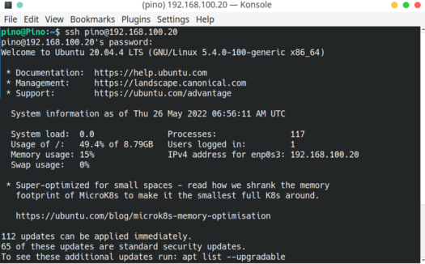

Apabila tampilan sudah seperti ini artinya kalian sudah berhail remote server

Selanjutnya untuk menginstall Apache2 kalian bisa gunakan command di bawah ini

```
sudo apt install apache2
```


Ketikan “y” lalu “enter


Prosess penginstallan Apache2

Apabila proses penginstalan sudah selesai kalian bisa mengcek status Apache2 dengan command di bawah ini

```
sudo systemctl status apache2
```

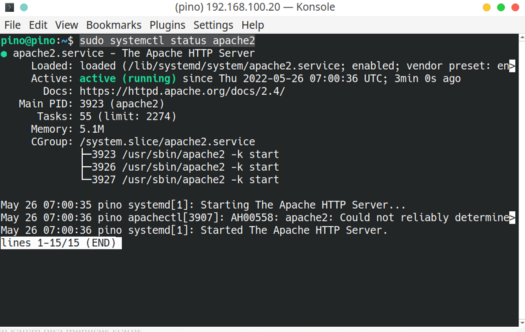

Langkah selanjutnya kita coba cek melalui browser dengan mengetikan ip server

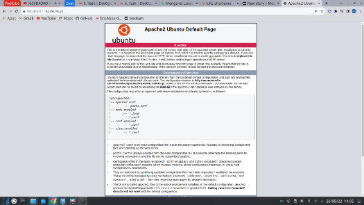

Jika tampilan seperti di atas artinya Instalasi Apache2 berhasil

# Membuat localtunnel pada web server apache2

Kita akan mencoba untuk menjalankan localtunnel agar server local kita dapat di akses secara publik. Berikut adalah step by step cara menggunakannya:

Pertama-tama yang kita lakukan adalah instalalsi node.js menggunakan nvm untuk melakukan instalasi kalian dapat mengikuti langkah-langkah dibawah ini.

```
sudo apt install curl
```

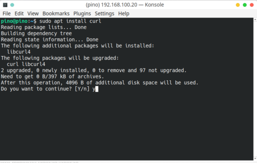

Selanjutnya ketik "y" lalu "Enter"

```
curl -o- https://raw.githubusercontent.com/nvm-sh/nvm/v0.39.1/install.sh | bash
```


```
exec bash
```

```
nvm install 14
```

```
node -v
```


Selanjutnya kita akan melakukan instalasi localtunnel menggunakan npm yang sudah kita install.

```
npm install -g localtunnel
```


Sekarang kita coba untuk menggunakan localtunel untuk aplikasi Apache2 yang sudah kita install.

Untuk menjalankan localtunel kalian dapat mengikuti perintah di bawah ini.

```
lt — port 80
```

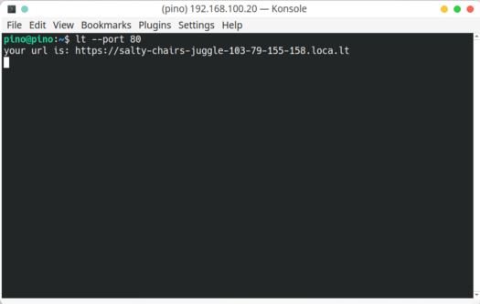

Kemudian salin URL lalu paste kan pada browser kalian


Klik tombol “Click to Continue”

Selanjutnya kalian akan di arahkan ke aplikasi kalian. Dan aplikasi kalian sekarang sudah dapat di akses oleh public.


Apabila tampilan seperti ini artinya local host kalian berhasil di install

Saya akan melakukan testing untuk mengakses Local Host Apache2 menggunakan smartphone.


Tampilan di smartphone
